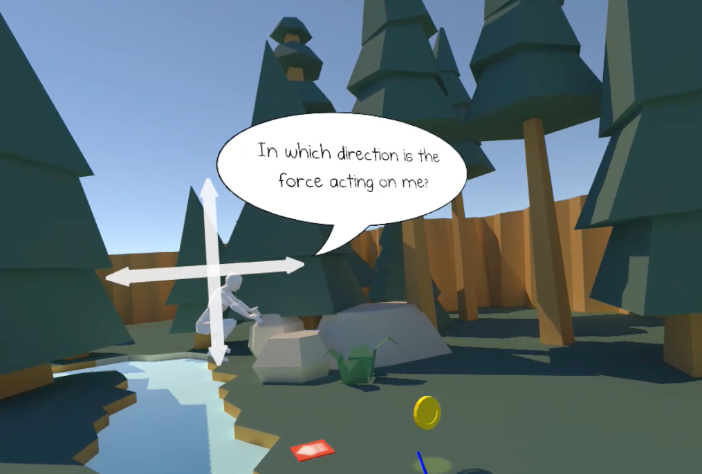

Over the past year or so I’ve been on and off helping out a teacher friend in my spare time. We’ve been building educational VR applications together. We’ve taken our stuff to the National Space Academy, he’s written about it in his Master’s thesis and even at the institute of Physics!

This is a blog series where I’m just going to record little by little some of the things we’re doing.

Today we added in a little feature to our main app, but one that we think will streamline the process a lot. The app itself is to teach people about projectile motion.

The scene is set by a lake, you are given control of a low poly person to point around where you will with a laser pointer. It’s like having a less cute cat.

The idea is that you get your low poly person over to one of the jump pads and they go hurtling across the river in a perfect parabola, landing safely upon the other side.

You perform this a couple more times, however on the third jump the application freezes time. Stranding your less cute cat equivalent at the peak of the parabola and poses you a question.

Where is the force acting on them?

You can then select where you _think_ it’s acting and the simulation shall continue with whatever direction you picked being applied to the universe.

If you picked down, the correct answer, then then your low poly compatriot shall drop to the ground perfectly. The other options create more comical results, however they also are a great example of _showing_ you why those answers are incorrect.

Now the micro problem we were facing is without tuition the user doesn’t necessarily know that the aim of the application is to hurtle the low poly explorer to the other side. After user testing this was starting to become quite obvious.

So we’ve turned to the oldest of gaming symbology to encourage the player to get to the other side: the Coin. Specifically [this one](https://skfb.ly/6IHPx) from SketchFab.

We wanted to find a way to show the player what to do _without tutorial_, since text in VR is generally trash and voice over is annoying if you already know the solution.

By using a piece of game language that is as universal as a spinning lit up coin it means that those who are unaware of what to do have a clue to figure it out, and those who were quick on the ball get to enjoy the shiny new coin anyway just for it’s shininess!

The more I develop for VR the more I’m realising how much is has in common with film.

_Show don’t tell_.
